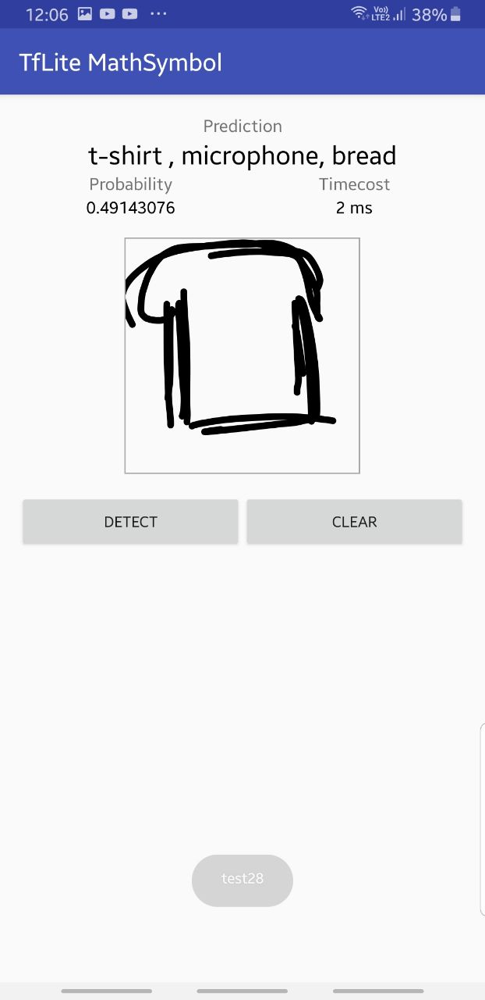
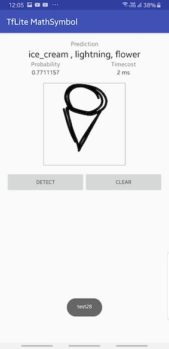
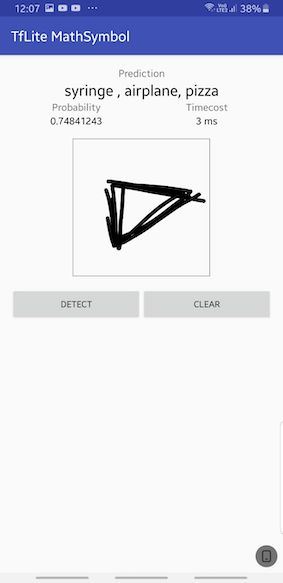

# quick-draw-keras-tflite-android

## To retrain the model
- checkout the colab link about , to build the model from scratch

## Pre-Trained model
- quickdraw-acc93.h5 
- quickdraw-acc93-v1.tflite
- 93% Test acc on holdout test set

## Tflite model for Android
- quickdraw-acc93.tflite

## Sample Image

## Download the APk file & Try in your phone
[Apk File](https://raw.githubusercontent.com/balaprasanna/quick-draw-keras-tflite-android/master/android/app/build/outputs/apk/debug/app-debug.apk)
